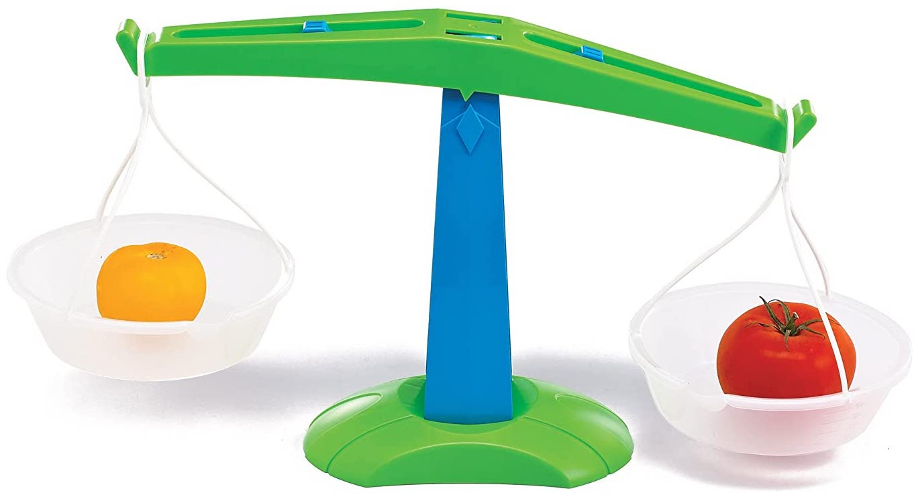

# Strange to ask what math is 'about'

- Wallis, in section 1.1 of *BGDM*, says that all math "rests on the
  foundations of set theory and numbers."

- We're not given a definition for 'number,' but we're told numbers
  have properties (attributes or characteristics). For example, an
  even number is divisible by two.

- Those attributes don't include visibility, since numbers aren't
  objects in space like the printed strings of numeric digits that
  represent numbers.

- The numeral string '651' represents the number six hundred fifty one in base
  10, but four hundred twenty five in base 8 (*BGDM* section 1.3).

- Numbers are abstract things; we can't see or touch them. So how
  exactly do we learn anything about them?

# Sets are abstract too

- Wallis defines a set as "any collection of objects, provided only
  that there is a well-defined rule, called the *membership law*, for
  determining whether a given object belongs to the set."

- We're told that a collection of tires or saucepans could constitute
  a set. Tires and saucepans are physical objects we can see and touch.

- But the set that physical objects belong to is not a physical object.

- Some philosophers consider sets to be ideas in our minds, but most
  mathematicians believe (or at least act like they believe) sets are
  abstract objects like numbers. They treat sets (and numbers) as if
  they were real objects outside of space and time.

- More on sets in the next presentation.

# Knowledge from experience

We obtain some kinds of knowledge (called '*a posteriori*,' meaning
'from the later') by means of experience and using our five
senses. For example, if we have two physical objects of roughly the
same size, we could find out which is heavier by placing them on a pan
balance.

\

# Knowledge via reasoning methods

- If we can't see, hear, feel, smell, or taste the things we want to
  know about, we have to learn about them through reasoning (thinking
  about them very carefully). Knowledge obtained this way is called
  '*a priori*,' meaning 'from the earlier.'

- The main worry that keeps mathematicians up at night is how we avoid
  making mistakes, since our intuitions about mathematical objects and
  their properties may not be correct.

- The math we learn in primary school and high school consists almost
  entirely of *effective methods*. These are procedures for solving a
  particular type of math problem like multiplying two numbers
  together or computing the area of a circle from the radius.

- We're taught to trust the effective methods given to us by our math
  teachers, but when do we ask how they're guaranteed to provide the
  correct answers?

# An effective method

- If humans had one fewer finger on each hand, we'd probably be more familiar with base 8 numerals.
- Instead of positions for ones, tens, hundreds, etc., we have
  positions for ones, eights, sixty fours, and so on.
- So any three digit string over the alphabet 0-7, can be converted from octal to decimal interpretation by:
    1. multiplying the right most digit by 1,
    2. multiplying the middle digit by 8,
    3. multiplying the left digit by 64, and
    4. adding those products together.

- So 651 in base 8 is the same number as $1 + 40 + 384 = 425$ in base 10.

# Proofs

- A mathematical proof is a rigorous, formal argument for the truth of
  a statement about mathematical objects or their properties.

- Each step in a proof is an essential link in the chain, but
  constructing a proof isn't a mechanical process like executing an
  effective method.

- Every proof is written for a particular audience. Some proofs for
  students are also intended to serve as explanations, but the purpose
  of a proof is to convince you that a statement is definitely true,
  not to clarify your understanding of the concept.

- The proof's audience determines the starting point (what is already
  understod to be true) and the rules of inference that take you from
  one step to another.

# Theorem 1.1 in *BGDM*

- The first proof that we find in Wallis's *Beginner's Guide to Discrete Math* is at the bottom of page 3.

. . .

**Theorem 1.1** $0.\bar{9} = 1$.

**Proof.** Suppose $x = 0.\bar{9}$. Then $10x = 9.\bar{9} = 9 + 0.\bar{9} = 9 + x$. So $9x = 9$ and $x = 1$.

. . .

# Proof in the reading

 Proof that $\bar{9} = \overline{9} = 1$

